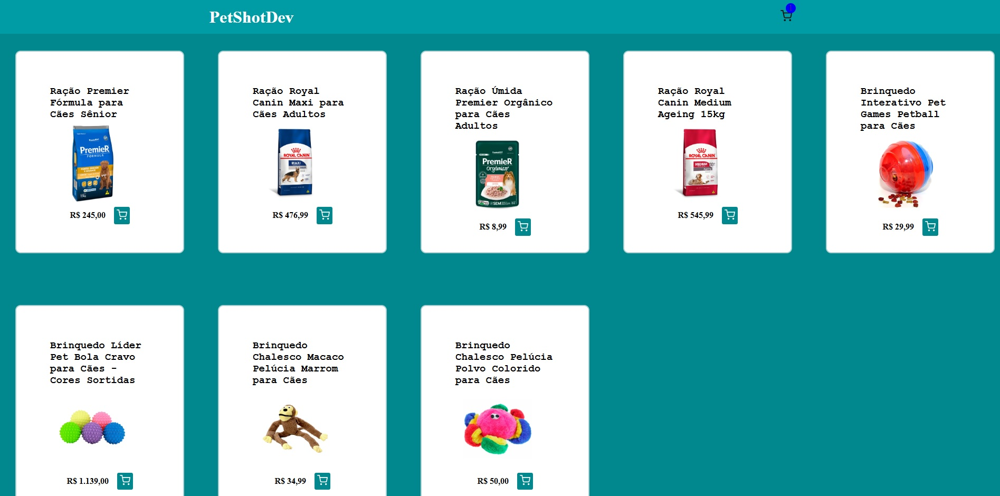

# Projeto de Carrinho de Compras

## Descrição
Este projeto é um carrinho de compras que utiliza uma API fake com o `json-server` para simular operações de backend.

## Tecnologias Utilizadas
- **JavaScript**: Linguagem usada no desenvolvimento.
- **TypeScript**: Utilizado para tipagem e prevenção de erros em tempo real.
- **Context API**: Para passar dados de forma mais eficiente e global.
- **React Router DOM**: Para manipulação de páginas.
- **Axios**: Para configurar e consumir a API.

Email: felipedequadrosgomes@gmail.com

LinkedIn: https://www.linkedin.com/in/felipe-de-quadros-gomes-b990012aa/